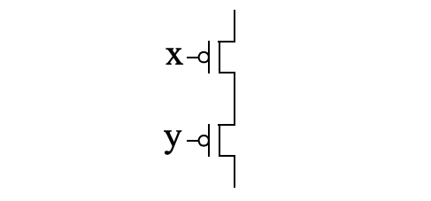

In the report, complete the following.
- Explain the objective of the problem.
- Give your solution.
- Include all your project codes in the [codes/assg](../../codes/assg) folder,
  if required.
- Explain your code snippets, if required.
- Include screenshots of the simulations in this folder, and insert them into
  the markdown file, if required.
- Explain why the simulations are correct, if required.

You can embed math equations into Github Markdown file using a [web service](https://www.codecogs.com/latex/eqneditor.php)

## (5 pts)
Describe the concept known as Moore’s Law.

  -the theory that the processesing speeds of computers double evry two years
## (5 pts)
Describe the behavior of the CMOS transistor
circuit shown below, clearly indicating
when the transistor circuit conducts.

## (5 pts)
If we apply a voltage to the gate of a CMOS transistor, why doesn’t the current flow
to the transistor’s source or drain?

## (5 pts)
 Why does applying a positive voltage to the gate of a CMOS transistor cause the
transistor to conduct between source and drain?

## (5 pts)
Which Boolean operation, AND, OR or NOT, is appropriate for each of the following:
- a. Detecting motion in any motion sensor surrounding a house (each motion sensor outputs 1 when motion is detected).
- b. Detecting that three buttons are being pressed simultaneously (each button outputs 1 when a button is being pressed).
- c. Detecting the absence of light from a light sensor (the light sensor outputs 1
when light is sensed).

## (5 pts)
Evaluate the Boolean equation F = (a AND b) OR c OR d for the given values of
variables a, b, c, and d:
- a. a=1, b=1, c=1, d=0
- b. a=0, b=1, c=1, d=0
- c. a=1, b=1, c=0, d=0
- d. a=1, b=0, c=1, d=1

## (5 pts)
Convert each of the following equations directly to gate-level circuits:
- a. F = ab’ + bc + c’
- b. F = ab + b’c’d’
- c. F = ((a + b’) * (c’ + d)) + (c + d + e’)

## (5 pts)
We want to concisely describe the following situation using a Boolean equation. We
want to fire a football coach (by setting F=1) if he is mean (represented by M=1). If
he is not mean, but has a losing season (represented by the Boolean variable L=1),
we want to fire him anyways. Write an equation that translates the situation directly
to a Boolean equation for F, without any simplification.
